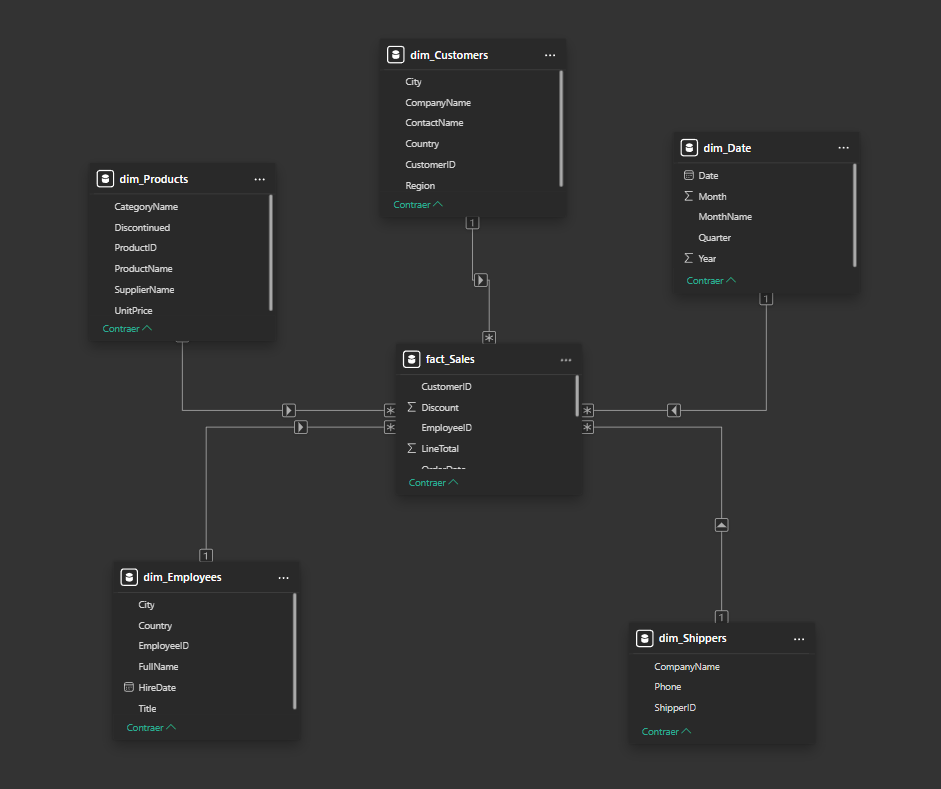

# Desafío Técnico: Ingeniería de Datos y Business Intelligence

## Descripción

Este repositorio contiene la solución a un desafío técnico diseñado para evaluar habilidades en **ingeniería de datos**, **cloud** y **modelamiento de datos para Business Intelligence**. El proyecto abarca desde la generación de datos sintéticos y su almacenamiento en la nube, hasta la implementación de un proceso batch, el desarrollo de una API REST y la creación de un modelo dimensional con su respectivo dashboard en Power BI.

---

## Tabla de Contenidos

1. [Desafíos de Ingeniería de Datos y Cloud](#desafíos-de-ingeniería-de-datos-y-cloud)

   * [Desafío #1: Generación de Datos Sintéticos](#desafío-1-generación-de-datos-sintéticos)
   * [Desafío #2: Almacenamiento de Datos](#desafío-2-almacenamiento-de-datos)
   * [Desafío #3: Migración de Datos (Proceso Batch)](#desafío-3-migración-de-datos-proceso-batch)
   * [Desafío #4: Modelo y Consulta de Datos](#desafío-4-modelo-y-consulta-de-datos)
   * [Desafío #5: Desarrollo de API REST](#desafío-5-desarrollo-de-api-rest)

2. [Modelamiento de Datos para BI](#modelamiento-de-datos-para-bi)

   * [Desafío #1: Modelo Dimensional en Power BI](#desafío-1-modelo-dimensional-en-power-bi)
   * [Desafío #2: Dashboard Interactivo](#desafío-2-dashboard-interactivo)

3. [Diagrama de Arquitectura](#diagrama-de-arquitectura)

4. [Estructura del Repositorio](#estructura-del-repositorio)

5. [Deuda Técnica y Puntos de Mejora](#deuda-técnica-y-puntos-de-mejora)

6. [Autor](#autor)

---

## Desafíos de Ingeniería de Datos y Cloud

La documentación específica para cada desafío se encuentra dentro de la carpeta `/docs`, con excepción del Desafío #2 del modelado de datos, que contiene notas dentro del archivo Power BI.

### Desafío #1: Generación de Datos Sintéticos

Se desarrolló un script en Python (`scripts/desafio_1.py`) que genera datos sintéticos para las siguientes entidades:

* **Departamentos**
* **Puestos de Trabajo**
* **Empleados**

Se utilizaron librerías como **numpy** y **Faker**, asegurando datos coherentes y listos para su posterior procesamiento.

---

### Desafío #2: Almacenamiento de Datos

Los datos generados fueron almacenados en formato **CSV** y **Parquet**.

**Justificación del uso de Parquet**:

* **Rendimiento:** Es un formato columnar que permite leer solo las columnas necesarias.
* **Compresión:** Reduce costos de almacenamiento y mejora la transferencia de datos.
* **Integración:** Compatible con ecosistemas Big Data y servicios en la nube (AWS S3, Azure Blob, Google Cloud Storage).

Los archivos Parquet se cargaron en un contenedor de **Azure Blob Storage** utilizando la capa gratuita.

---

### Desafío #3: Migración de Datos (Proceso Batch)

Se implementó un proceso batch para transferir los datos de los archivos Parquet a **Supabase** y Azure Blob.

El script `scripts/desafio_3.py` realiza:

1. Lectura de archivos Parquet desde el origen local.
2. Carga eficiente de datos en la base de datos de destino.

---

### Desafío #4: Modelo y Consulta de Datos

Se creó una **vista (`vw_employees_summary`)** que consolida información de empleados, departamentos y puestos. Esto permite simplificar consultas analíticas.

El script para la creación de la vista y ejemplo de consulta se encuentra en `scripts/desafio_4.ipynb`.

**Consulta de ejemplo:**

```sql
SELECT department_name, job_title, AVG(salary) AS avg_salary, MIN(salary) AS min_salary, MAX(salary) AS max_salary, COUNT(*) AS employee_count
FROM vw_employees_summary
GROUP BY department_name, job_title
ORDER BY department_name, avg_salary DESC;
```

---

### Desafío #5: Desarrollo de API REST

Se desarrolló una **API REST con FastAPI** para exponer la vista creada.

**Endpoints disponibles:**

* `GET /employees`
  Retorna los primeros N empleados (limit por defecto 50).
  Ejemplo: `GET http://localhost:8000/employees?limit=100`

* `GET /employees/department/{department_name}`
  Retorna empleados de un departamento específico, ordenados por salario descendente.
  Ejemplo: `GET http://localhost:8000/employees/department/finanzas`

* `GET /employees/job/{job_title}`
  Retorna empleados de un cargo específico, ordenados por salario descendente.
  Ejemplo: `GET http://localhost:8000/employees/job/analista`

El código fuente está en `scripts/desafio_5_api.py`.

> **Nota:** El Desafío #6, referente al despliegue en contenedores, no fue realizado.

---

## Modelamiento de Datos para BI

### Desafío #1: Modelo Dimensional en Power BI

* Fuente de datos: OData `https://services.odata.org/v4/Northwind/Northwind.svc`
* Modelo dimensional (esquema estrella) con tablas de hechos y dimensiones.
* Relaciones 1:* entre dimensiones y hechos.
* Optimización de tipos de datos y consultas con queries personalizadas.
* Archivo Power BI: `powerbi/`



### Desafío #2: Dashboard Interactivo

Indicadores clave visualizados:

* Ventas Totales
* Cantidades Vendidas
* Margen de Descuento

Características:

* Filtros interactivos (año, mes, cuatrimestre, país, trabajador, categoría)
* Medidas DAX para cálculos precisos
* Inteligencia temporal para análisis de tendencias
* Diseño estético y paleta de colores consistente

> Dentro del `.pbix` hay una página oculta con notas técnicas y optimizaciones del modelo.

---

## Diagrama de Arquitectura

Se encuentra en `docs/Modelado de datos - desafio 1.pdf`.

---

## Estructura del Repositorio

```
/data           # Archivos CSV y Parquet
/docs           # Documentación y notebooks
/powerbi        # Archivos de Power BI (.pbix)
/scripts        # Scripts de generación, migración y API
.env            # Variables de entorno
README.md       # Documentación general
```

---

## Deuda Técnica y Puntos de Mejora

1. **Despliegue y Orquestación (Desafío #6):**
   No se implementó la API en contenedores ni su orquestación.

2. **Generación de Datos de Prueba (Desafío #1):**
   Faker generó datos coherentes, pero no adaptados a un contexto local específico.

3. **Optimización del Almacenamiento en la Nube (Desafío #2):**
   Se podrían profundizar la importacia de los archivos Parquet en entornos cloud.

4. **Aprovechamiento del Data Lake (Desafío #3):**
   El Blob Storage podría integrarse directamente con herramientas como Power BI o Databricks para análisis a gran escala.

5. **Despliegue de API (Desafío #5):**
   Para maximizar el aprovechamiento de la API, se debería despleguar en plataformas como Render, lo que permitiría su disponibilidad en línea y facilitaría su integración con otros servicios o aplicaciones.

6. **Gestión de Secretos y Configuración:**
   Se recomienda usar servicios como Azure Key Vault o AWS Secrets Manager.

---

## Autor

**Carlos Rivera**

* [LinkedIn](https://www.linkedin.com/in/carlos-rivera-ds/)
* [GitHub](https://github.com/AnndrezRivera)

```
```
